# Novacart E-Commerce Lakehouse Project

## Project Summary

This project demonstrates an end-to-end production-style Data Engineering pipeline using **SQL Server, Databricks, Delta Lake, PySpark, and Power BI**.

The pipeline ingests e-commerce data from SQL Server tables such as `products`, `orders`, and `payments` into Databricks using incremental loading. The data is processed through a **Medallion Architecture**: Bronze, Silver, and Gold layers.

The project focuses on real-world data engineering concepts:

- Incremental ingestion using watermark logic
- Bronze/Silver/Gold Lakehouse architecture
- Delta Lake tables
- Data cleaning and standardization
- Deduplication using PySpark window functions
- Data quality validation
- Quarantine handling for bad records
- Control tables for pipeline tracking
- Gold-level fact, dimension, and summary tables
- Business dashboards and pipeline monitoring

---

## Architecture Diagram

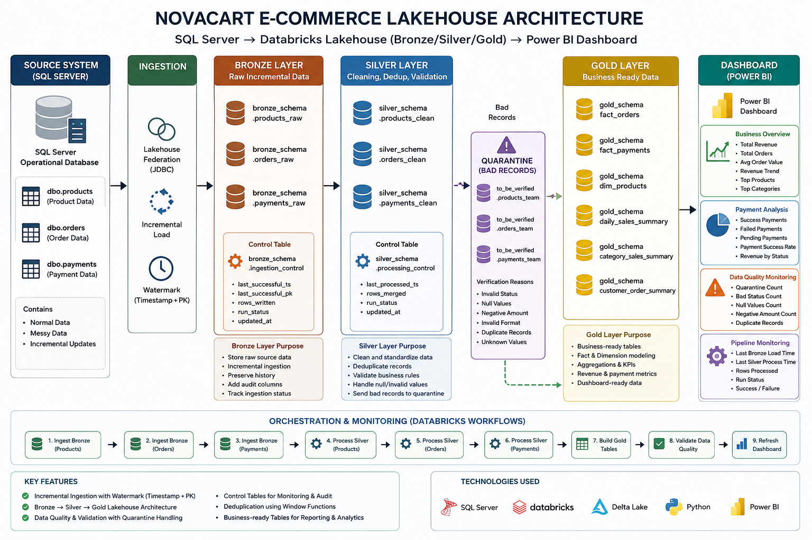

---

## Project Architecture

```text
SQL Server Source
        |
        | Incremental Load using Timestamp + Primary Key Watermark
        v
Bronze Layer
        |
        | Raw data + audit columns + ingestion control
        v
Silver Layer
        |
        | Cleaning + deduplication + validation
        |
        |---- Bad Records ----> Quarantine Tables
        |
        v
Gold Layer
        |
        | Business-ready fact, dimension, and summary tables
        v
Power BI / Databricks SQL Dashboard
```
---

## Tech Stack

| Tool / Technology | Purpose |
|---|---|
| SQL Server | Source relational database |
| Databricks | Lakehouse platform for data engineering |
| PySpark | Data cleaning, transformation, and processing |
| Delta Lake | Reliable storage with ACID transactions |
| Lakehouse Federation / JDBC | Reading SQL Server source data |
| Databricks Workflows | Pipeline orchestration and scheduling |
| Power BI / Databricks SQL | Reporting and dashboarding |
| GitHub | Version control and project documentation |

---

## Source Tables

The source system contains three SQL Server tables:

```text
dbo.products
dbo.orders
dbo.payments
```
Example messy data handled in this project:
```
Blank status values
Null customer IDs
Unknown payment status
Negative order amounts
Price values with $ symbols
Comma-based decimal values
Category typo such as ELECTRINICS
Extra spaces in text columns
```

##Bronze Layer

The Bronze layer stores raw incremental data from SQL Server.
```
bronze_schema.products_raw
bronze_schema.orders_raw
bronze_schema.payments_raw
```
Bronze Responsibilities

* Read new records incrementally from SQL Server
* Preserve raw source data
* Add ingestion audit columns
* Track ingestion status using a control table
* Maintain raw history for debugging and replay

##Silver Layer
```
Bronze Raw Tables
        |
        | Read latest processed Bronze watermark
        v
Filter only new Bronze records
        |
        v
Apply cleaning and standardization rules
        |
        v
Deduplicate records using window functions
        |
        v
Apply data quality validation rules
        |
        |---------------- Bad Records ----------------|
        v                                             v
Valid Records                                  Quarantine Tables
        |
        v
MERGE / Upsert into Silver Clean Tables
        |
        v
Update Silver Processing Control Table
        |
        v
Silver data ready for Gold processing
```
Silver Responsibilities

The Silver layer handles the following responsibilities:

* Read only new Bronze records
* Clean messy string values
* Standardize status and category values
* Convert string amounts to decimal values
* Fix known source data issues
* Remove duplicate records
* Apply data quality rules
* Separate invalid records into quarantine tables
* Merge clean records into Silver Delta tables
* Update Silver processing control table after successful completion

### Silver Control Table

The Silver control table tracks incremental processing for each entity. It stores the latest processed Bronze timestamp, Silver run ID, rows merged, run status, and update time. This makes the Silver layer incremental, restartable, and auditable.

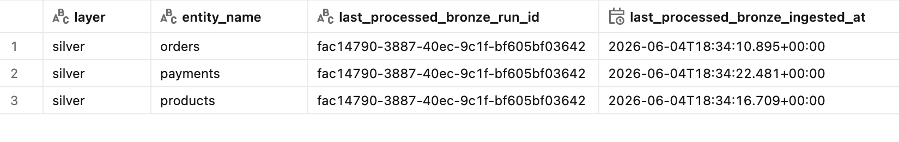

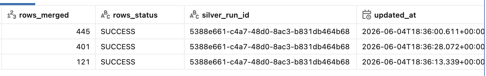

---
### Silver Orders Cleaned Output

The `orders_clean` table contains cleaned, standardized, deduplicated, and validated order records from the Bronze layer.

In this step, order data is processed by trimming spaces, standardizing order status values, converting order amounts into decimal format, removing invalid records, and keeping only the latest valid record for each `order_id`.


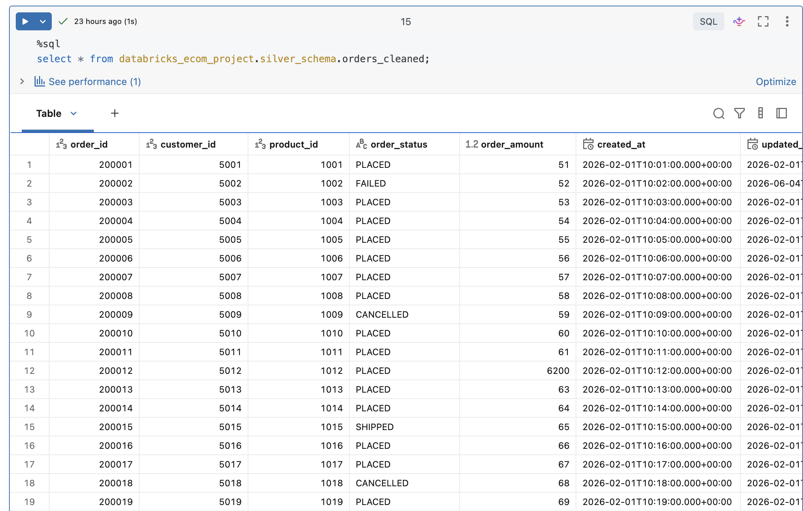

## Quarantine Handling - Data Quality Exception Management

The Quarantine layer stores records that fail Silver-level validation rules. Instead of dropping bad records silently, the pipeline captures them separately with a clear verification reason for debugging, monitoring, and business review.

This approach helps maintain trusted Silver and Gold tables while still preserving invalid records for investigation.

---

### Why Quarantine Is Needed

Real-world source data can contain issues such as:

```text
Null customer IDs
Blank order statuses
Unknown payment statuses
Negative order amounts
Invalid product prices
Missing product categories
Amount fields containing $ symbols or comma values
```
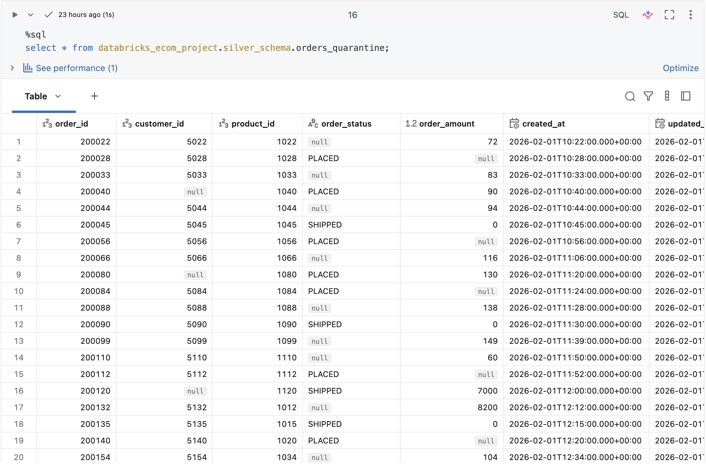
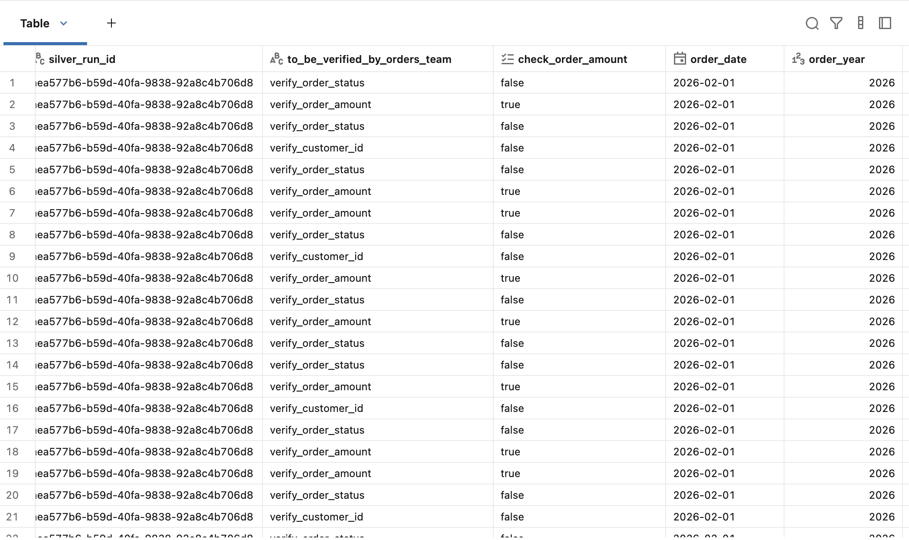

---

## Gold Layer - Business-Ready Analytics

The Gold layer creates business-ready tables from cleaned Silver data. These tables are used for reporting, dashboards, payment analysis, category performance, and historical tracking.

Gold processing is incremental. Instead of rebuilding all tables every time, the pipeline identifies only changed Silver records and recalculates impacted orders.

---

### Gold Input Tables

```text
silver_schema.orders_transformed
silver_schema.products_transformed
silver_schema.payments_transformed
```
# Gold Layer - Impacted Orders & SCD Type 2 Processing

This project implements the **Gold Layer** of an end-to-end Databricks Lakehouse pipeline for an e-commerce dataset.

The Gold layer is designed to process only **impacted orders** instead of recomputing the entire dataset every time. This makes the pipeline more efficient, scalable, and closer to real-world production data engineering practices.

## What This Gold Layer Does

The Gold pipeline identifies changed or impacted `order_id` values from:

- Orders
- Payments
- Products

After identifying impacted orders, the pipeline rebuilds only those affected records in the Gold table.

## Key Features

- Impacted-order based processing
- Incremental Gold table updates
- Joins orders, products, and payments data
- Calculates payment completion ratio
- Creates payment state such as:
  - Paid
  - Partially Paid
  - Overpaid
- Maintains Gold audit columns
- Implements SCD Type 2 history tracking
- Tracks current and historical order records using:
  - `valid_from_ts`
  - `valid_to_ts`
  - `is_current`

## Impacted Order IDs

The pipeline first collects all impacted order IDs from upstream Silver tables.

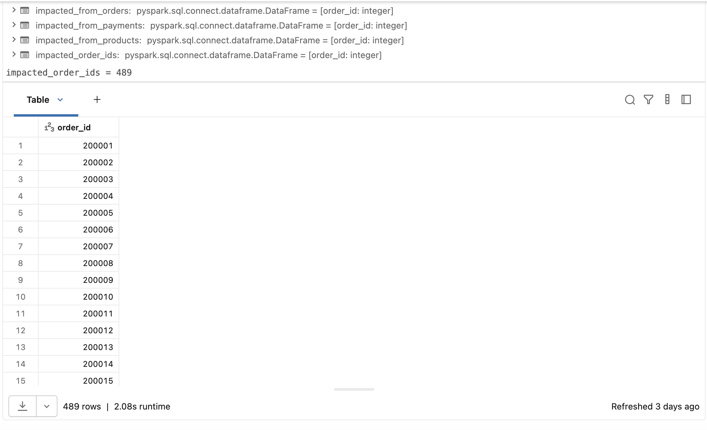

## Gold Orders Information

After identifying impacted orders, the pipeline rebuilds the final Gold records with business-ready order information.

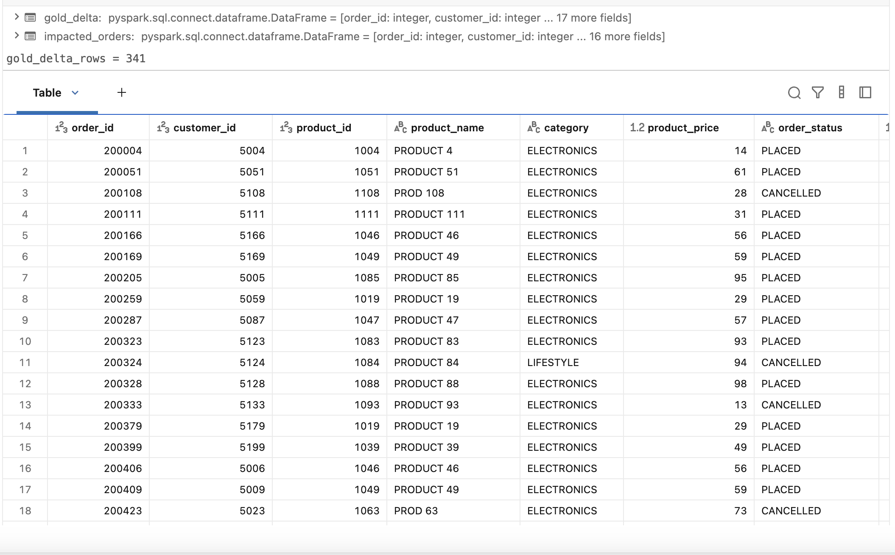

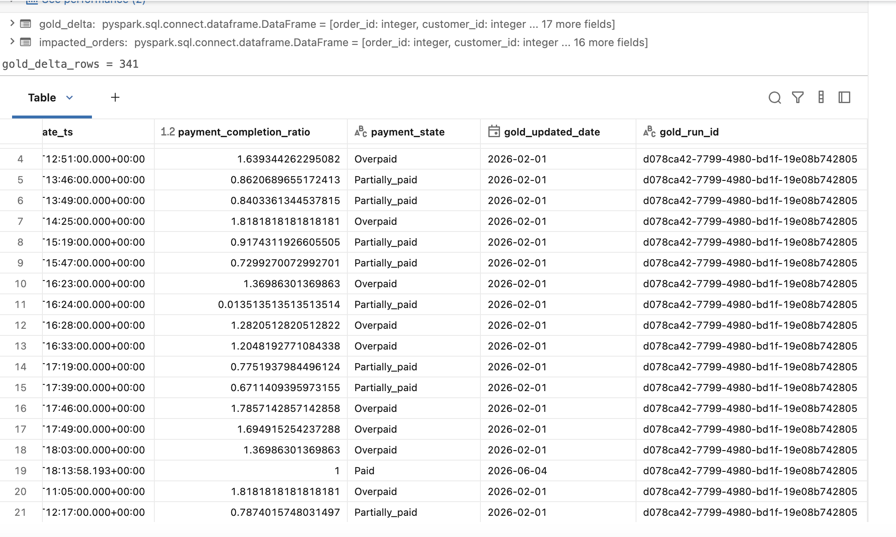

## SCD Type 2 Output

The Gold layer also maintains order history using SCD Type 2 logic.

When an order changes, the old record is expired and a new current record is inserted.

Example:

- Old record: `is_current = false`
- New record: `is_current = true`

.png)

.png)

## Why This Is Important

This design avoids full-table recomputation and processes only changed business entities.

In real-world data engineering, this helps with:

- Better performance
- Lower compute cost
- Faster pipeline execution
- Historical tracking
- Auditability
- Reliable reporting

## Tables Used

### Input Silver Tables

- `silver_orders`
- `silver_products`
- `silver_payments`

### Output Gold Table

- `gold_schema.orders_information_scd2`

## Main Business Logic

The pipeline:

1. Finds impacted order IDs from changed orders, products, and payments.
2. Joins the required Silver tables.
3. Recalculates Gold business columns.
4. Updates the Gold SCD Type 2 table.
5. Keeps only the latest record as current.
6. Preserves older versions for history.

## Sample Validation Query

```sql
SELECT *
FROM databricks_ecom_project.gold_schema.orders_information_scd2
WHERE order_id = 200002;
```
## Dashboard & Databricks Workflow

This project includes a Databricks dashboard and an automated job pipeline to validate the final Gold layer output.

The dashboard is built on top of the Gold tables and shows business-level KPIs for the e-commerce pipeline.

## Dashboard Highlights

- Shows total orders processed from the Gold layer
- Tracks total paid amount and GMV
- Displays order distribution by product category
- Shows payment status summary such as Success, Failed, and Pending
- Identifies top products by revenue
- Helps validate whether the Gold table is ready for business reporting

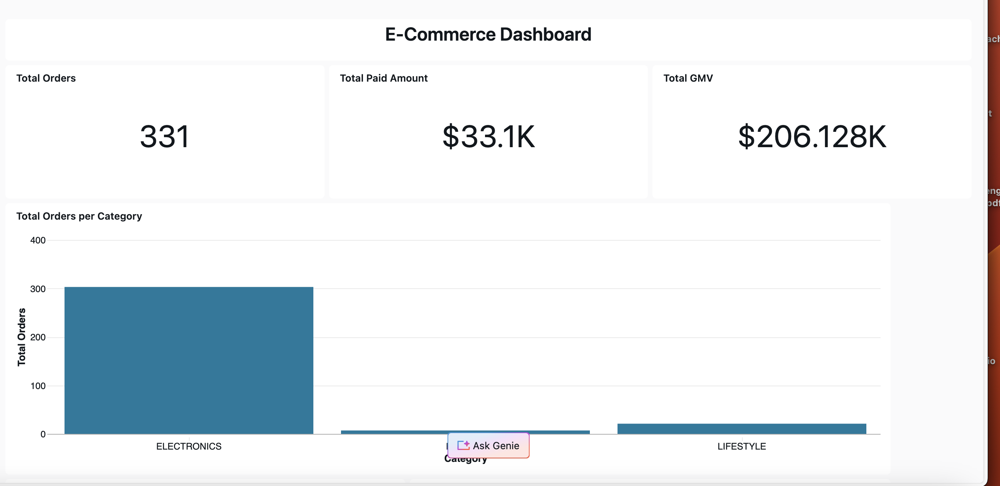

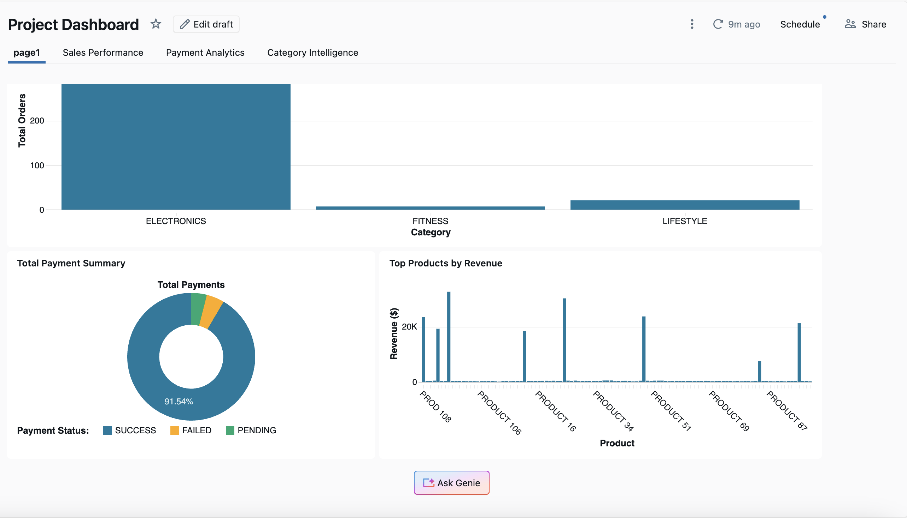

## Databricks Jobs & Pipeline

The complete pipeline is orchestrated using Databricks Jobs and Workflows.

Pipeline flow:

1. Bronze Work - incremental raw data ingestion
2. Silver Work - data cleaning, validation, and deduplication
3. Gold Work - impacted-order processing and SCD Type 2 updates
4. Dashboard - business reporting from Gold tables
5. Alert Task - notification after pipeline execution

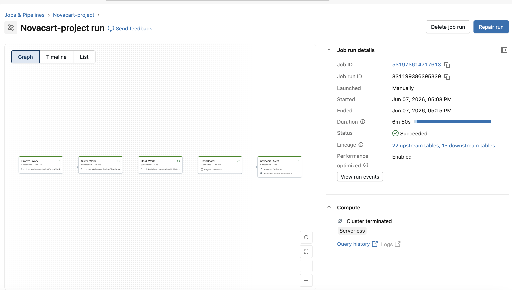

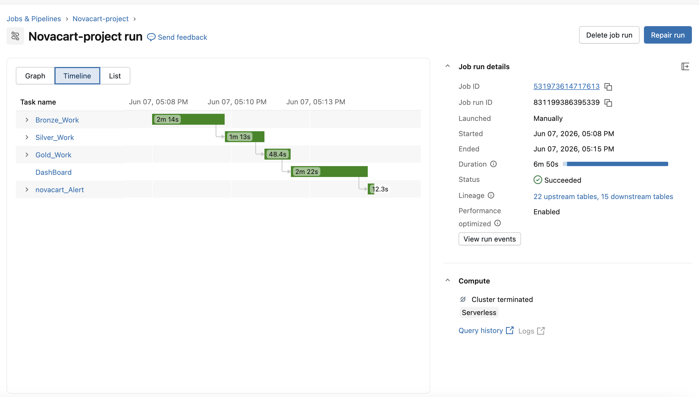

## Workflow Execution

The workflow completed successfully with:

- Bronze, Silver, Gold, Dashboard, and Alert tasks
- Serverless compute
- Performance optimization enabled
- Job lineage tracking
- Upstream and downstream table visibility
- End-to-end execution monitoring

## Why This Adds Value

This shows that the project is not just notebook-based.  
It includes production-style orchestration and reporting.

Key concepts demonstrated:

- Databricks Workflows
- Task dependency management
- End-to-end pipeline orchestration
- Dashboard creation
- Monitoring job duration
- Successful pipeline execution tracking
- Business-ready reporting from Gold tables


